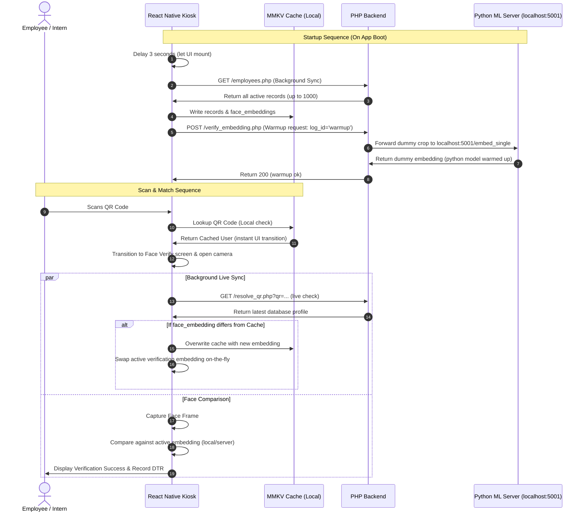

# System Design: Kiosk First-Load Background Sync & Face Engine Warmup

## Goal
Optimize first-scan and face verification performance, and support real-time face embedding update propagation (re-registration) without causing UI lag or repetitive network queries.

---

## 1. System Components & Data Flows



---

## 2. Startup Synchronization & Warmup

### 2.1 Background Sync on Boot
When the app launches:
1. Wait **3 seconds** using `setTimeout` to prioritize rendering the main screen.
2. Check network connectivity. If online, invoke `refreshOfflineUserCache()`.
3. `refreshOfflineUserCache()` fetches `/employees.php` (returning the active directory) and writes it to the local MMKV cache.
4. This resolves the empty cache issue on first launch. Subsequent QR scans will instantly use the cached profile.

### 2.2 Face Verification Engine Warmup
To eliminate the 1-2 second delay on the first face scan:
1. **Local Mode:** On boot, the app initializes the ONNX session and triggers a dummy forward run inside `loadFaceModel` with a zeroed-out tensor. (Already implemented in `model.ts`).
2. **Server Mode:** In `App.tsx` startup sequence, trigger a POST fetch to `${BACKEND_URL}/verify_embedding.php` with `{ log_id: 'warmup', live_image_b64: 'dummy' }`.
3. Modify `/verify_embedding.php` to handle a `warmup` request:
   - If `log_id === 'warmup'`, forward the dummy image crop to the Python ML server `http://localhost:5001/embed_single` using cURL.
   - Return a success response `{"ok": true, "message": "Warmup completed."}` without querying the database, warming up waitress and the cURL pool.

---

## 3. On-The-Fly Target Embedding Swap

### 3.1 QR Scanned Success Flow
In `useAttendance.ts` -> `handleBarCodeScanned`:
1. Look up user in local MMKV cache via `resolveOfflineUserFromQr`.
2. If found, call `setSelectedUser(cachedUser)`, transition to screen `detecting` (camera), and start face verification.
3. Simultaneously, run `resolveUserFromQr(data)` in the background.
4. When `resolveUserFromQr` resolves:
   - If the returned `face_embedding` (array or JSON-string) does not match the current cached embedding, write the updated user to MMKV via `upsertOfflineUserCacheUser`.
   - Call `setSelectedUser(resolvedUser)`. Since `setSelectedUser` updates `selectedUserRef.current` internally, the active face comparison loop will dynamically read the new embedding on the next frame.

---

## 4. Multi-Mode Backend Alignment (Employees vs Interns)

The synchronization and lookup logic must differentiate between employee and intern modes to query the correct database columns, tables, and API structures.

### 4.1 Employee Mode (Supabase)
* **Metadata Table:** `employees` (`emp_id`, `name`, `role`, `dept_id`, `log_id`)
* **Credentials/Face Table:** `accounts` (`log_id`, `username`, `qr_code`, `profile_picture`, `face_embedding`)
* **List Fetching Endpoint:** `/employees.php?page=x&limit=y`
* **QR Resolver (`resolve_qr.php`):** Queries Supabase by `log_id`/`username` and returns `face_embedding` as a serialized string or array.

### 4.2 Intern Mode (MySQL)
* **Metadata/Face Table:** `interns` (`id`, `first_name`, `last_name`, `email`, `profile_photo`, `face_embedding`, `qr_code`, `department_id`, `status`)
* **List Fetching Endpoint:** `/employees.php?page=x&limit=y` (Queries IMS connection, returns mapped schema).
* **QR Resolver (`resolve_qr.php`):** Queries MySQL local connection and returns decoded JSON array `face_embedding` under `user`.

Both modes map to the unified `CachedOfflineUser` format on the client:
```typescript
export type CachedOfflineUser = {
  userId: string;          // log_id / intern_id
  empId: string;           // emp_id / intern_id
  username: string;        // account username / intern_id
  name?: string | null;    // employee name / first_name + last_name
  qrCode?: string | null;  // qr_code / TDTINTRN + id
  profile_picture?: string | null;
  face_embedding?: string | number[] | number[][] | null;
  isIntern?: boolean;
};
```

---

## 5. Implementation Spec Self-Review
1. **Placeholders check:** None. All endpoints, parameters, and tables are defined.
2. **Consistency check:** Handled both local ONNX and server-assisted modes. The dynamic swap will update the React state (`selectedUser`) and `selectedUserRef` which is read by both local compare and server API verify methods.
3. **Scope check:** Sized appropriately for a single implementation plan.

---

## 6. Verification Plan
* **Boot Sync Verification:** Verify that `refreshOfflineUserCache` is invoked once on startup and loads cached profiles successfully.
* **Warmup Verification:** Monitor server logs to confirm `/verify_embedding.php` handles `'warmup'` requests and makes a connection to Python's `/embed_single` on app mount.
* **Face Re-Registration Swap Verification:** Modify a cached user's face embedding on the server. Scan the QR code. Confirm the camera opens instantly, the background fetch completes, updates the MMKV cache, and the active session successfully compares against the new embedding.
